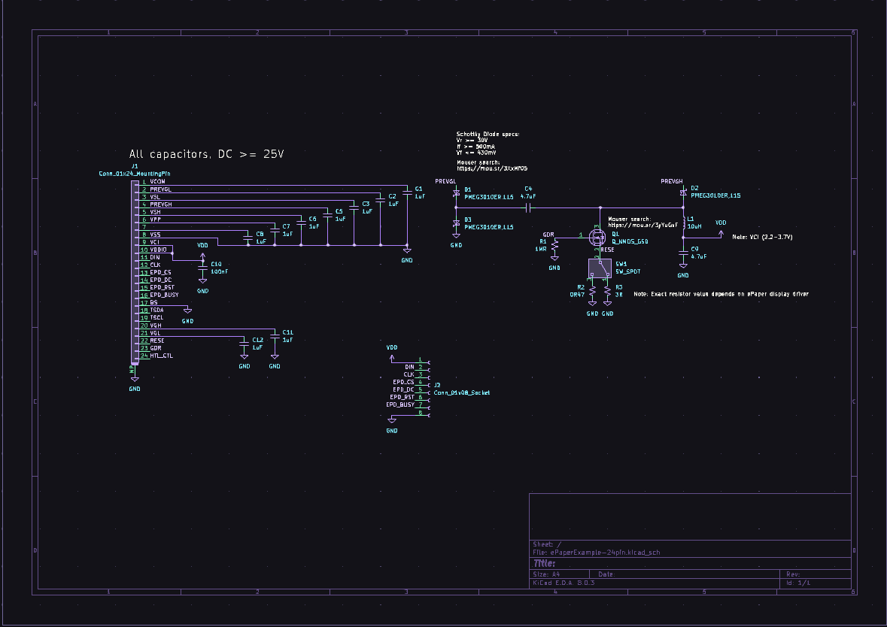

# A KiCAD 8 Schematic for Waveshare/Good Display 24-pin ePaper Displays

  

Based on the Waveshare ePaper shield. Includes links to parametric search for critical components.  

**Please refer to the datasheet for your specific driver IC to confirm component values and specifications.**
